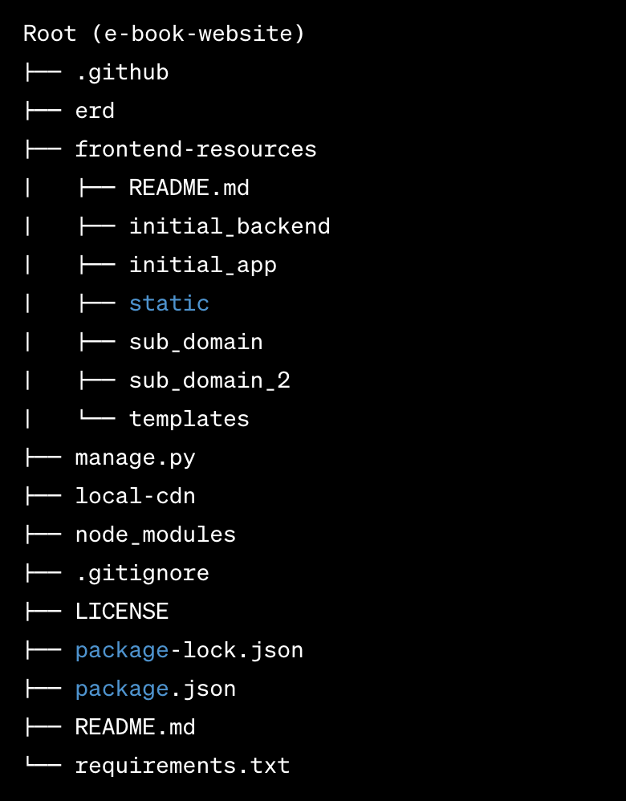

# Frontend Resources

Notes, commands and resources for understanding the frontend development for this repository.

This is the current view for the Django app.

`http://127.0.0.1:8000/` // displays "initial_backend/templates/pages/construction.html"


## Technologies

Tailwind CSS, Node

## Folder Structure Overview



## Directories

- CSS FILES
- [/local-cdn](/local-cdn) // contains copies of static files for deployment
- [/initial_backend/static](/initial_backend/static) // all Static files for the app
- [/initial_backend/css](/initial_backend/css) // output css file for TailwindCSS
- [/initial_backend/imgs](/initial_backend/imgs) // all images for the app
- [/initial_backend/tailwind](/initial_backend/tailwind) // input css file for TailwindCSS

- HTML FILES
- [/initial_backend/templates](/initial_backend/templates) // all HTML files for the app
- [/initial_backend/templates/base.html](/initial_backend/templates/base.html) // base HTML template
- [/initial_backend/templates/head](/initial_backend/templates/head) // HTML files injected to every base.html file
- [/initial_backend/templates/pages](/initial_backend/templates/head) // specialized HTML pages that extend base.html

- PYTHON FILES
- [/initial_backend/initial_app/views.py](/initial_backend/initial_app/views.py) // renders construction view
- [/initial_backend/initial_app/urls.py](/initial_backend/initial_app/urls.py) // renders construction view

## Installation

#### <b>Before running any commands</b>, make sure you are in the correct directory.

For node installation, remain in the root directory: `e-book-website`

Download packages specified in an existing package.json file

```bash
npm install
```

## Getting Started

Make sure you have the `npm run dev` command running in your terminal while you're working on the project, and Tailwind CSS will take care of updating the output file for you automatically whenever you modify the input file.

For the node server, remain in the root directory: `e-book-website`

```bash
npm run dev
```

<hr>

For the Django server, navigate to the sub-directory: `initial-backend`

Start the Django development server in a separate terminal:

```bash
python3 manage.py runserver
```

<hr>

Keep both servers running while developing in the app

Refresh the browser at `http://127.0.0.1:8000/` to view changes to the app

## Ongoing Bug

An import of JQuery into an HTML file causes the `python3 manage.py collectstatic` command to import ~140 JQuery files into `./localcdn`. Editing the command in the following way temporarily resolves this bug:

```
python3 manage.py collectstatic --noinput --clear --no-post-process --ignore css --ignore img --ignore js
```

## Resources

- [TailwindCSS Documentation](https://tailwindcss.com/)
- [Coding Entrepreneurs Django & TailwindCSS Youtube Tutorial](https://www.youtube.com/watch?v=lsQVukhwpqQ)
- [Coding Entepreneurs Djando & TailwindCSS Codebase](https://www.codingforentrepreneurs.com/courses/django-x-tailwindcss/)

## Contributing

Please familiarize yourself with TailwindCSS and app directories in order to contribute. To make a contribution, please create a new branch from main and title the branch as the feature you intend to build. Initiate a pull request, and tag @sasszz as a reviewer.
